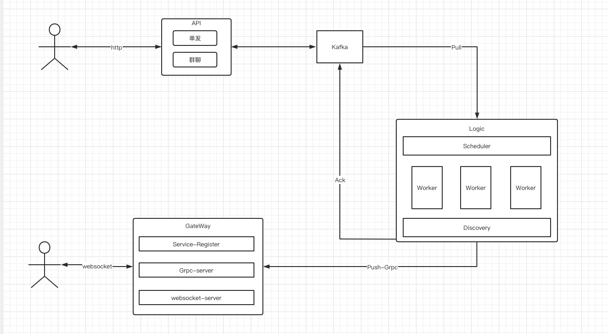

imGlobal 1.0
==============

imGlobal is an im server writen in golang.

### Functions List
- [x] 基于Grpc服务通信
- [x] 数据传输基于protobuf
- [x] 分布式、无状态、分层，理论上支持无限水平扩展
- [x] 群聊
- [x] 基于Redis实现服务发现
- [ ] 单聊
- [ ] 权限验证
- [ ] 用etcd实现服务发现

## Architecture

